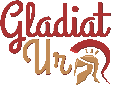

An AI-Competition in the spirit of [BattleSnake](https://github.com/battlesnakeofficial) but playing the [Royal Game of Ur](https://en.wikipedia.org/wiki/Royal_Game_of_Ur) 
against each other. 
So far the game works with basic-rules. There is a game-server available at http://gladiat-ur.kjarrigan.de
if you want to jumpstart developing an AI with one of the starter kits. Otherwise check the [Self-Hosted GameServer](#self-hosted-gameserver)
section below on how to operate your personal setup.

---
**Table of Contents**

1. [Getting Started](#getting-started)
   1. [Developing your own AI](#developing-your-own-ai)
   2. [Let your AI compete against someone else](#let-your-ai-compete-against-someone-else)
2. [Self-Hosted GameServer](#self-hosted-gameserver)
3. [Development](#development)
   1. [AI-Starter Kits](#ai-starter-kits)
4. [FAQ](#faq)
4. [Core Team](#core-team)
---

## Getting Started

If you want to develop your own AI and participate in the competition checkout our `starters/`. These
are available in multiple languages but don't worry if you favorite language is not (yet) available.
You can particiapte with basically every language as long as it can handle json and http-requests.

### Developing your own AI

Checkout the [Client-API](docs/CLIENT_API.md) on how to get started.

### Let your AI compete against someone else

This part is Work-in-Progress. Eventually we want a nice Web-Platform to manage AIs, Games, Tournaments and a Ranking System. But
you can alreay start and play right now.

#### Register your AI

The GameServer connects to your AI via HTTP-Requests (not the other way around) so it has to be reachable via 
WWW (in self-hosted setups localhost or LAN might work as well). You can register it like this

```bash
$ curl -XPOST gladiat-ur.kjarrigan.de/players -d '{"name":"MyAI","url":"http://example.com:8080","token":"TOKEN"}'
```

The token is no passwort for the server but actually the other way around. Whenever the server sends you a request it'll 
add the token as HTTP-Header `Auth: Bearer TOKEN` so you can verify that the request is from the actual game server.

#### Play a new Game

Again - this part is Work-in-Progress. For now you have to initiate the games yourself:

```bash
$ curl -XPOST gladiat-ur.kjarrigan.de/game -d '{"players": ['MyPreviouslyRegisteredAI', 'SomeoneElse']}'

{ "game": { "id": "12345" }, "winner": "white" }

# Get the full replay-log and some more meta-data
$ curl gladiat-ur.kjarrigan.de/game/12345
```

## Self-Hosted GameServer

### From Source

* Install crystallang (v1.3.2+)
* git clone git@github.com:KjarrigansGames/GladiatUr.git
* shards install
* crystal build exe/server --release

### Pre-Built

* Goto https://github.com/KjarrigansGames/GladiatUr/releases
* Download a binary (currently statically linked, linux-only)

### Docker

`Not yet available`

## Development

### GameServer

Is currently located in `exe/` and only contains non-game-logic API endpoints. It's written in
Crystal.

### GameLogic

Is located in `src/` and also written in Crystal

## FAQ

### How did you come up with the idea?

Recently we particapted in another Godot Wild Jam and build our version of the Royal Game of Ur.
Part of that was to setup some (basic) AI you can play against. We figured, that although the gamegit dif
rules are pretty simple, there is actually quite some room strategy. Since we have participated in
BattleSnake a couple of times we came to the conclusion that it actually

### It feels a lot like BattleSnake!

Not really a question but yes the base concept on how the AI-API works is adapted from BattleSnake
because we really liked the idea and how easily you can start with any language of your choice.

### Will there be other game modes / rules?

Maybe. We've some ideas on how to tweak the game to provide additional challenges but let's flesh
out the base-game first and suppress the feature-creep as long as possible.

### I found a bug / I want to work on this?

You're welcome to open issues and/or pushing Pull Requests. We'll try to reply within a reasonable
timeframe. You probably already know the drill but for completeness sake:

1. Fork it (<https://github.com/KjarrigansGames/GladiatUr/fork>)
2. Create your feature branch (`git checkout -b my-new-feature`)
3. Commit your changes (`git commit -am 'Add some feature'`)
4. Push to the branch (`git push origin my-new-feature`)
5. Create a new Pull Request

## Core Team

- [Holger Arndt](https://github.com/Kjarrigan)
- [Markus Freitag](https://github.com/MarkusFreitag)
